# Social Media Privacy Risk Assessment Framework

> A defensive, educational Streamlit application that estimates social media privacy exposure from account visibility, personal-data sharing, account behavior, connected apps, and security controls.

---

## Author

**Adarsh Srivastav**

Cybersecurity | Privacy | Python | Streamlit

---

## Project overview

The **Social Media Privacy Risk Assessment Framework** is a local, interactive assessment tool for reviewing privacy and account-security settings across common social platforms. It calculates a heuristic risk score, classifies the result, highlights contributing factors, and provides tailored actions to reduce exposure.

The app includes an illustrative sample assessment so the dashboard opens with a complete example. Users can change the form inputs and submit a new assessment. Results and settings are calculated in the current app session; the app does not connect to social media accounts or store account history.

This project is an educational screening prototype. Its score is not a validated measure, platform audit, legal determination, or guarantee of account security.

---

## Objectives

- Demonstrate a practical privacy-risk review workflow for social media accounts.
- Combine profile exposure, behavior, and security controls in one transparent heuristic score.
- Classify the score into Low, Moderate, High, or Critical risk bands.
- Show risk contributions and exposure dimensions with interactive visualizations.
- Provide recommendations based on the selected account settings.
- Generate a downloadable PDF summary for presentation or personal review.
- Keep the demonstration self-contained and avoid collecting social-platform credentials or real account data.

---

## Key features

- Six selectable social platforms: Instagram, Facebook, X, LinkedIn, TikTok, and Snapchat.
- Eleven scored privacy and security factors.
- Risk score from 0 to 100, with Low, Moderate, High, and Critical classifications.
- Executive summary and side-by-side assessment scorecards.
- Severity legend and positive/protective versus exposure risk-driver chart.
- Risk heatmap and exposure radar.
- Clearly labeled illustrative risk trajectory; no historical scores are stored.
- Personalized recommendations based on selected settings.
- Downloadable PDF report containing the assessment summary and profile settings.
- Premium dark Streamlit dashboard with a branded NexaGuard header.
- Twelve screenshot examples in the `screenshots/` directory.

---

## Architecture

```text
User-selected account settings
              |
              v
      Heuristic risk scoring
       /       |        \
      v        v         v
 Risk band  Risk drivers  Recommendations
       \       |        /
              v
     Dashboard visualizations
   (scorecards, heatmap, radar,
       illustrative trajectory)
              |
              v
       Downloadable PDF
```

The application runs as a single local Streamlit app. It does not include a backend API, database, social-platform integration, or account-history service.

---

## Assessment factors

The heuristic score considers:

- Profile visibility
- Personal data exposure
- Connected third-party apps
- Posting frequency
- Audience size
- Location sharing
- Multi-factor authentication
- Device security
- Password hygiene
- Privacy controls
- Account age footprint

The displayed risk-driver values show each factor's contribution to the score. Security controls can reduce the score; the final value is bounded between 0 and 100.

### Risk bands

| Score | Classification |
|---:|---|
| 0–29 | Low |
| 30–59 | Moderate |
| 60–79 | High |
| 80–100 | Critical |

---

## Technologies

| Area | Technology |
|---|---|
| Language | Python |
| Dashboard | Streamlit |
| Tabular data | pandas |
| Interactive visualizations | Plotly |
| PDF generation | ReportLab |
| Theme | Streamlit configuration and app styling |

---

## Project structure

```text
Social Media Privacy Risk Assessment Framework/
├── .streamlit/
│   └── config.toml              # Streamlit theme configuration
├── screenshots/
│   ├── 01_dashboard_overview.png
│   ├── 02_account_settings.png
│   ├── 03_executive_summary.png
│   ├── 04_risk_drivers.png
│   ├── 05_risk_heatmap.png
│   ├── 06_exposure_radar.png
│   ├── 07_risk_trajectory.png
│   ├── 08_recommended_actions.png
│   ├── 09_pdf_report.png
│   ├── 10_framework_interpretation.png
│   ├── 11_scorecards_severity.png
│   └── 12_security_controls.png
├── app.py                       # Risk logic and Streamlit interface
├── requirements.txt             # Python dependencies
├── README.md                    # Project documentation
├── .gitignore                   # Local and generated files excluded from Git
└── .venv/                       # Local virtual environment (not committed)
```

---

## Requirements

- Python 3.10 or newer
- pip
- Windows, macOS, or Linux

---

## Installation and run

Run commands from the project root.

### Windows PowerShell

```powershell
py -m venv .venv
.\.venv\Scripts\Activate.ps1
python -m pip install -r requirements.txt
streamlit run app.py
```

### macOS / Linux

```bash
python3 -m venv .venv
source .venv/bin/activate
python -m pip install -r requirements.txt
streamlit run app.py
```

Open the local URL printed by Streamlit, usually `http://localhost:8501`.

---

## Using the dashboard

1. Review the illustrative sample assessment shown on the initial page.
2. Set the platform and account/privacy inputs in the form.
3. Select **Assess risk**.
4. Review the executive score, risk band, scorecards, risk drivers, heatmap, radar, and recommendations.
5. Use **Download PDF report** to export the current assessment.

Use sample or fictional values for demonstrations. The app does not sign in to, query, or modify any social media account.

---

## Screenshot evidence

The following portfolio screenshots were captured from the local application. They show the dashboard, assessment workflow, visualizations, recommendations, and generated PDF using illustrative data.

### Dashboard and assessment

#### 1. Dashboard overview

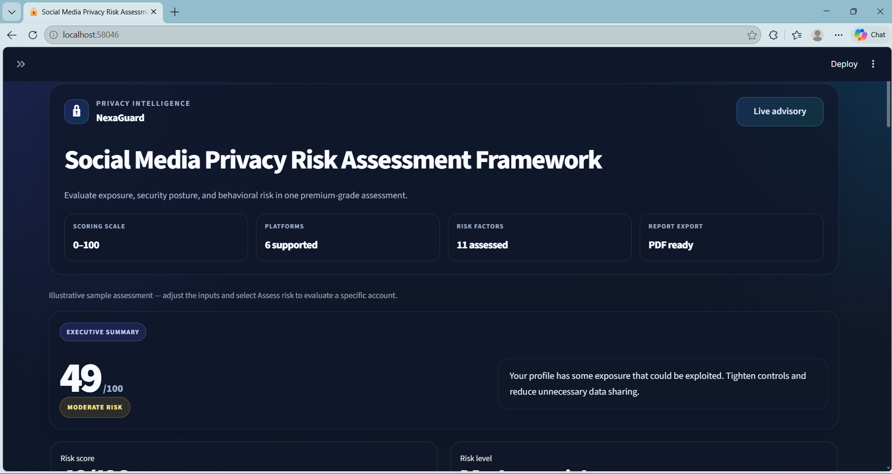

The branded opening view introduces the assessment and shows the sample result.

#### 2. Account and privacy settings

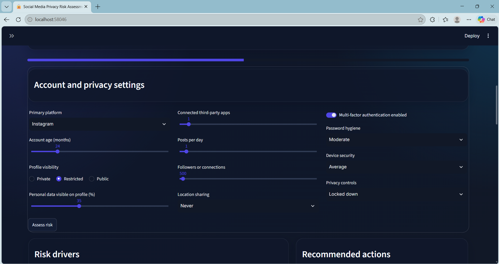

The form presents platform, account age, profile visibility, personal-data exposure, and account controls.

#### 3. Executive summary

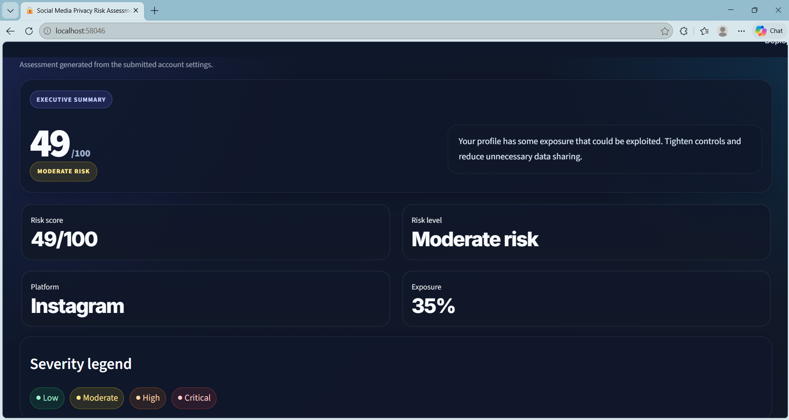

The sample assessment's 49/100 score, Moderate risk classification, and explanatory summary are shown together.

#### 4. Risk drivers


The horizontal chart shows the score contribution of each factor, including protective controls.

#### 5. Risk heatmap

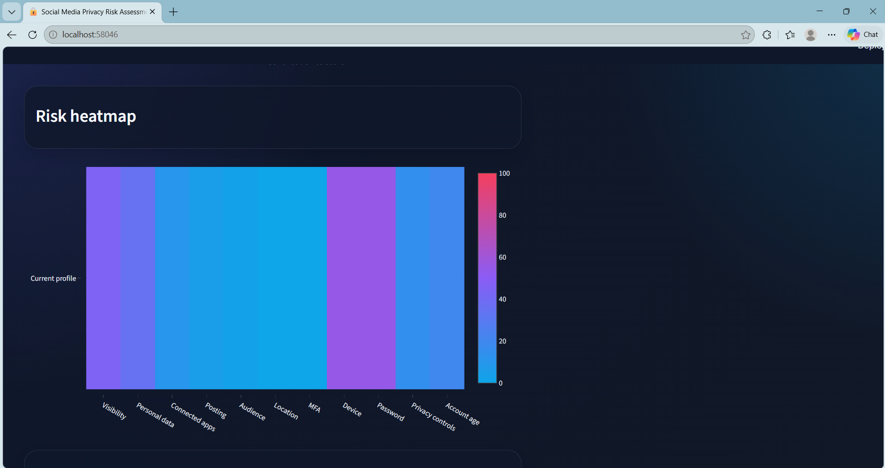

The heatmap compares the selected profile's exposure dimensions on a 0–100 color scale.

#### 6. Exposure radar

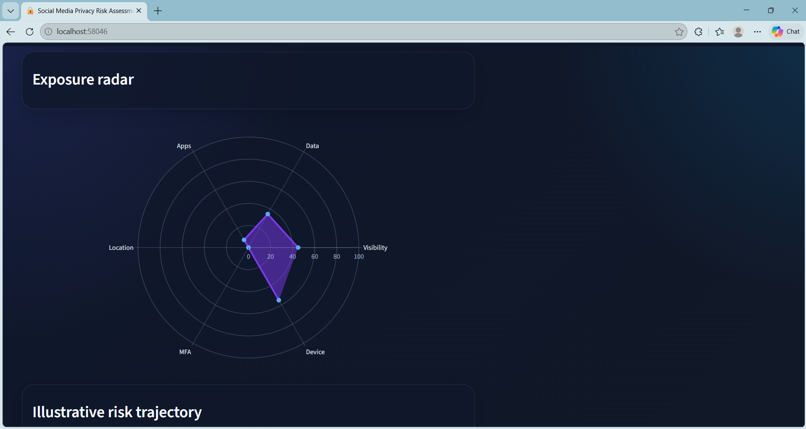

The radar chart visualizes exposure across visibility, data, apps, location, MFA, and device security.

#### 7. Illustrative risk trajectory

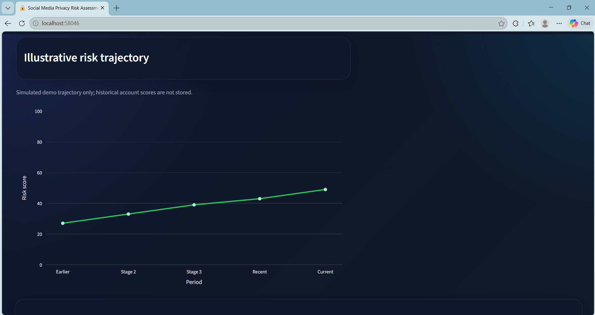

The example trajectory is simulated for demonstration; it is not historical account data.

#### 8. Recommended actions

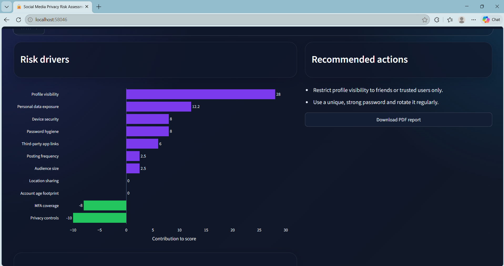

The recommendations are tailored to the selected settings and include the PDF export control.

### Report and supporting views

#### 9. PDF report

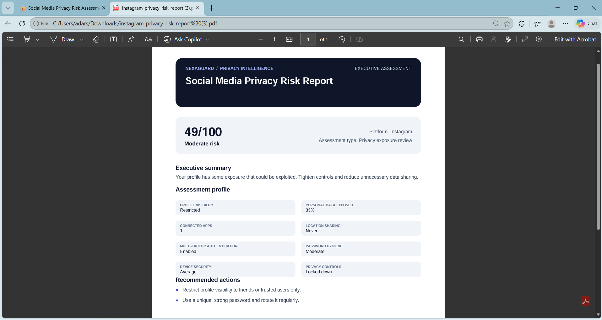

The exported report includes the score, classification, summary, selected profile settings, and recommendations.

#### 10. Framework interpretation

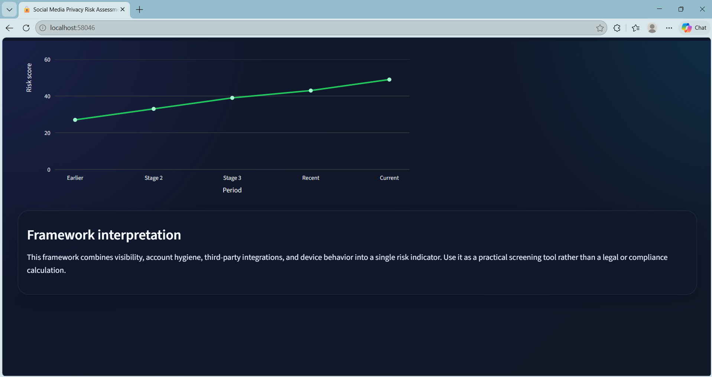

The interpretation explains the intended use of the combined risk indicator.

#### 11. Scorecards and severity legend

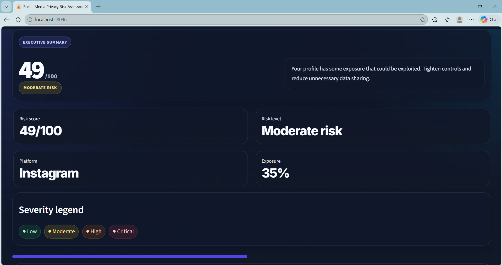

The scorecards summarize the assessment, while the legend defines the four severity bands.

#### 12. Security controls

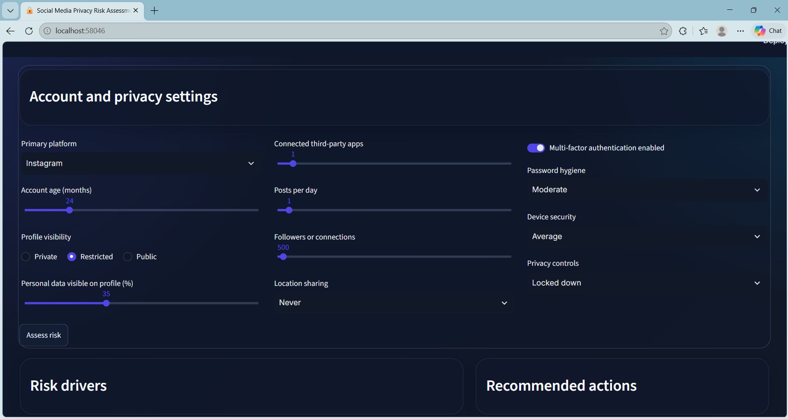

The settings view highlights connected apps, posting, audience size, location sharing, MFA, password hygiene, device security, and privacy controls.

---

## Validation

The app has been checked for Python syntax, successful local startup, browser rendering, sample risk scoring, chart values, and generated PDF output.

---

## Security, privacy, and ethics

- This is a local educational assessment tool, not a security audit.
- Do not enter passwords, authentication codes, or other account secrets.
- The app does not collect social media credentials or connect to platform APIs.
- Use fictional or consented values in screenshots and demonstrations.
- The risk model is heuristic and should not be treated as a guarantee or compliance result.

---

## Limitations

- Risk weights and thresholds are illustrative and have not been validated against real-world outcomes.
- The score does not reflect platform-specific security controls or changing platform policies.
- The risk trajectory is simulated; assessment history is not saved.
- Assessment values are not persisted to a database.
- The PDF is a summary of the current form assessment, not an official audit report.
- The prototype is not a substitute for professional privacy or security advice.

---

## Future scope

- Add transparent factor-by-factor scoring explanations and configurable weights.
- Add optional local persistence for a user's explicitly saved assessment history.
- Improve platform-specific guidance without requesting account credentials.
- Add accessible chart descriptions and a more detailed PDF export.
- Add automated tests for score boundaries, recommendations, and report generation.

---

## Skills demonstrated

### Privacy and cybersecurity

- Privacy exposure assessment
- Account security hygiene
- Risk classification and mitigation guidance
- Responsible, privacy-conscious demonstration design

### Python and analytics

- Python application development
- Heuristic scoring logic
- pandas data presentation
- Plotly interactive charts
- PDF generation with ReportLab

### Dashboard and communication

- Streamlit dashboard development
- Visual risk communication
- Executive summaries and report exports
- Project documentation and screenshot evidence

---

## Project status

**Educational local prototype with illustrative scoring.**

The application is suitable for coursework and demonstration. It is not a validated privacy-risk standard or a production account-security product.
